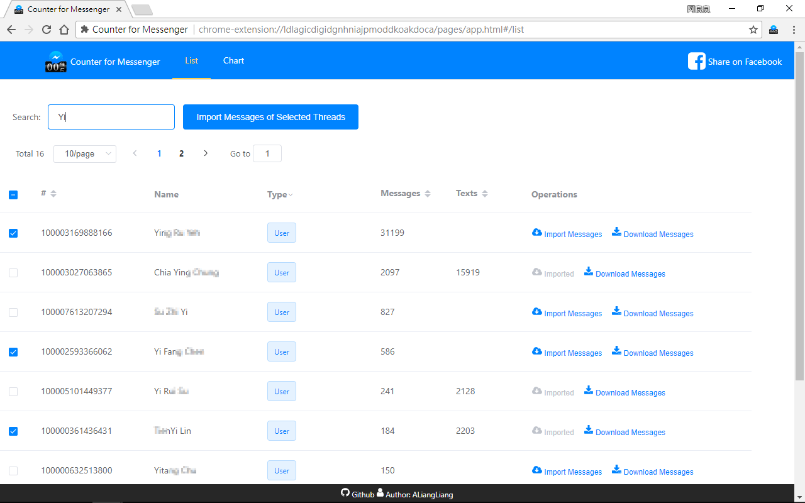
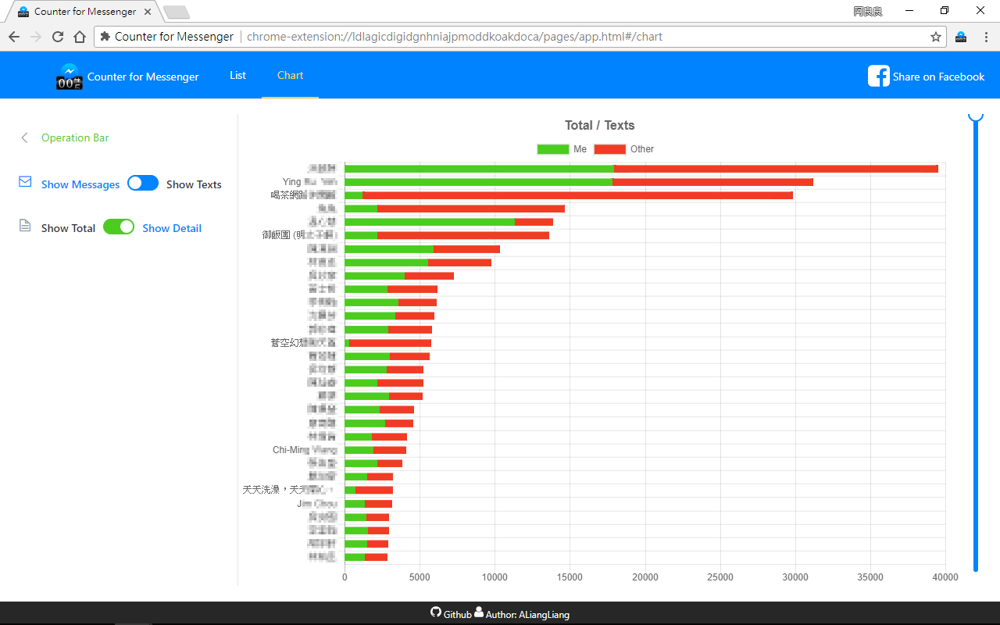

# Counter for Messenger

## 簡介

當初是為了想要去統計自己 Messenger 訊息聊天的狀況，而開發的 Chrome Extension，藉由接 Messenger 的 API 來取得使用者過往所有歷史訊息，來計算出對話成員各自的訊息量、文字量等資訊，並且以圖表來呈現，除了分析以外，訊息下載備份也是它的基本功能，此外可以透過它來設定各個聊天室的群組名稱、背景顏色、表情符號等。

發布至今已累積 241360 次安裝，與 75516 最高單周使用次數。

DEMO 截圖

## 技術背景

> 技術關鍵字：Chrome Extension、JavaScript、Vue.js、Chart.js、IndexedDB、CSS、ElementUI、Webpack、Google Analytics

(WIP)

## 未來發展

### 採用 Vuex

在開發初期因 Vuex 尚未廣泛使用，所以未使用它來做狀態管理，導致開發上需要層層遞送資料與設定事件，資料流變得相當複雜，若再次開發將一定會使用 Vuex 來做狀態的管理，減少元件間的耦合性。

### 優化記憶體使用、資料儲存

因為使用者的訊息總量不同，部分使用者的資料非常龐大，導致下載時間過長，且會使用大量記憶體資源，甚至導致系統崩潰，使用者體驗不佳，這在一開始設計上是未曾考慮的，所以在開發上也必須去主動管理資料的釋放，降低資源消耗。

## 結論

這是我使用人次最高的也是很有前景的一項業餘專案，當初在開發時，也因收到許多良好的回饋，想過收費來提供更多的資料分析與呈現，但最後因進入研究所，且碰上 Chrome Web Store 政策緊縮導致產品下架，所以忍痛放棄維護，但也在此接觸到使用者的回饋重要性，以及效能瓶頸的考驗。