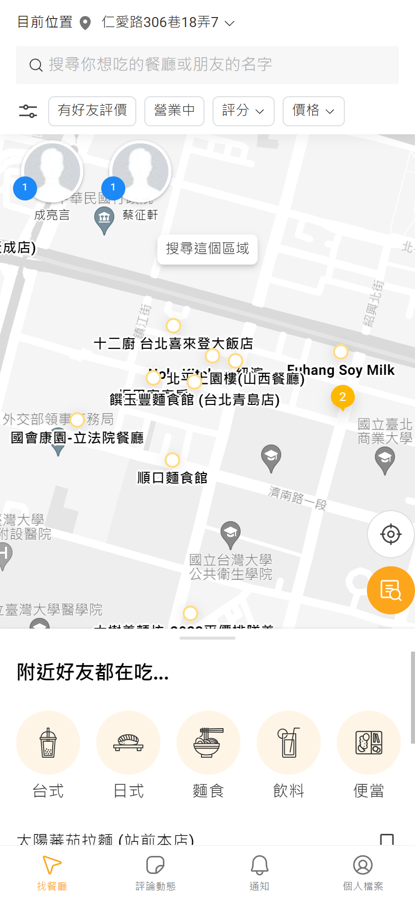
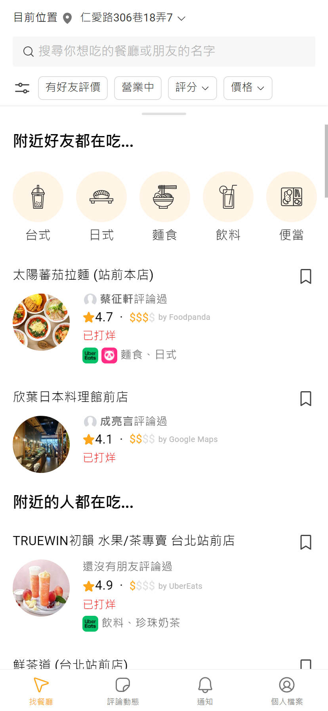
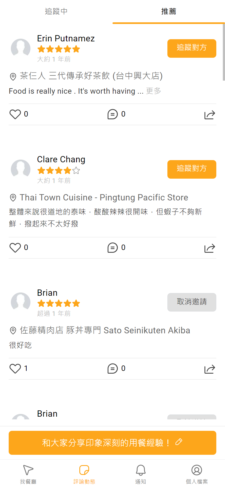
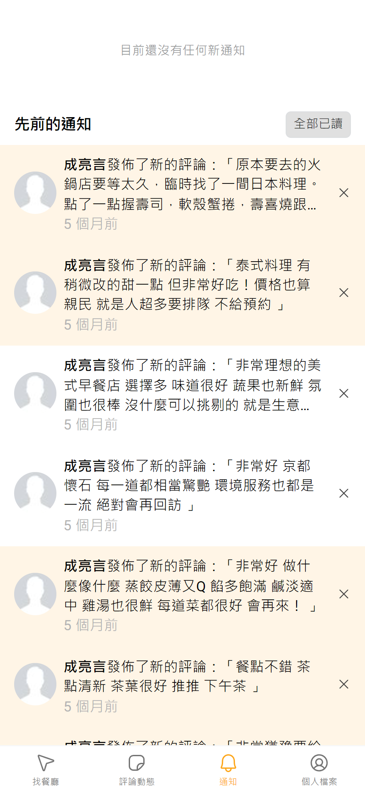
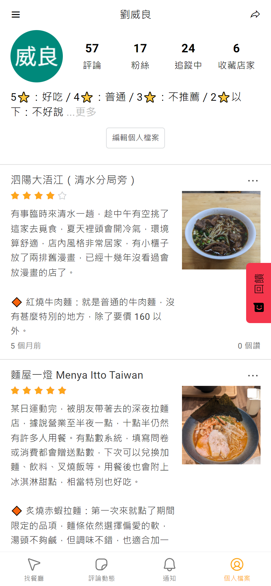

# DineOneOne - 美食社交平台

## 簡介

在 DineOneOne inc. 擔任全端工程師時，與其他兩位工程師與設計師共同開發的美食社群平台，透過此平台可以讓使用者分享、收藏、評論美食，並且透過搜尋功能找到附近的美食店家。
技術上考量快速開發、低成本，採用 Firebase 為基礎設施，並且使用 Vue.js 搭配 PWA/TWA，快速打造為跨網頁與 Mobile APP，後端則使用 Python 搭配 Firebase Cloud Functions 來處理商業邏輯。

https://www.dineoneone.com.tw/

> 技術關鍵字：Vue.js、Python、Firebase/GCP、PWA、TWA

## 專案負責工作

- 初始技術選用與實作
- 前端應用程式開發
- 後端商業邏輯設計
- 與設計師溝通設計規格
- 與其他前後端工程師協作開發

## 技術細節

### 前端

- Typescript
- Vue.js
- PWA/TWA
- Vue Router
- Pinia

### 後端

- Python3
- Firebase
  - Firestore
  - Functions
  - Hosting
  - Authentication
  - Storage

### 其他

- Git
- GitHub Action (CI/CD)
- Figma

## 困難點

### Github Action 消耗過多預算

我們的開發流程是每個 commit 皆會經過 code linting、type checking 與 unit test，在 CI/CD 建置完成後一個月，發現大幅超出額度。  
故我立即在自有機器上架設臨時 self-hosted runner 來應急，並著手開始優化。我們專案是 monorepo，所以有數個子專案在內部互相依賴，透過調整設定後，只會有該 commit 有變動過的子專案會跑 CI/CD 流程。  
最後大幅減少 65% 的預算消耗，讓我們能夠在額度內穩定開發。

## Screenshots

