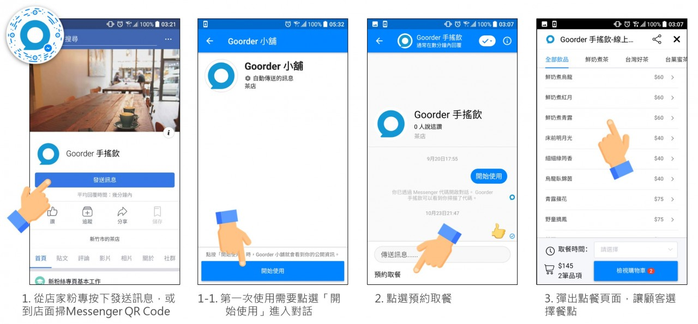
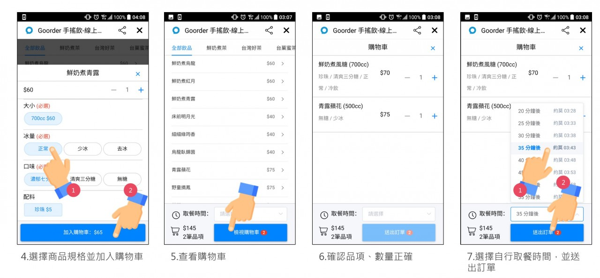
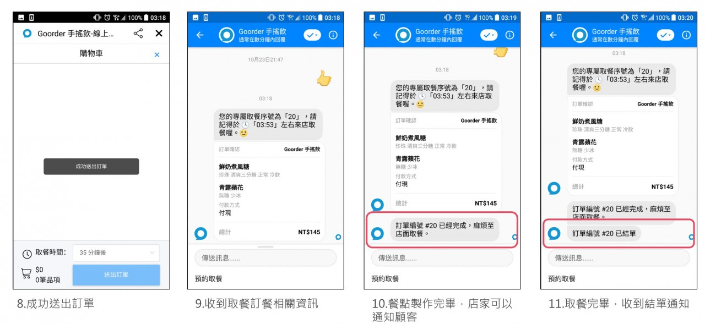
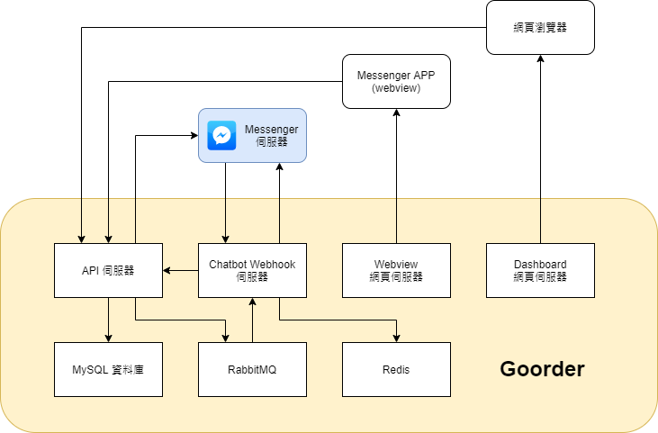

# Goorder - Messenger/LINE 雙平台點餐聊天機器人

## 簡介

此專案是我個人於研究所期間發展的一個創業項目，想要為中小型餐飲業者解決建置「更容易為消費者使用」的線上訂餐平台，藉由聊天機器人避免使用者額外安裝 APP 與申請帳號，相比傳統 APP 與網頁服務，可以大幅增加使用者的使用意願與留存率。

使用者操作步驟

## 技術背景

> 關鍵字：Node.js、Express.js、Vue.js、Chatbot（Messenger／LINE）、MySQL、Redis、RabbitMQ、CI/CD、Gitlab、GCP、GKE（K8S）、Helm Chart

採用 Node.js 來開發後端伺服器，並部署在 GCP 的 GKE（Google Kubernetes Engine） 上，程式碼托管在 Gitlab，透過 Gitlab 與自架的 CI server，來做 CI/CD。

## 系統架構

這套系統會分成四支服務：

### API server

這支伺服器主要負責 Chatbot 的 Webview 介面、店家端的管理後台、Chatbot Webhook 的邏輯處理，並且是唯一會跟資料庫通訊的服務。

### Chatbot Webhook

當使用者傳送訊息時，大部分的資訊會透過這支服務的伺服器來接收，在做邏輯處理後，發送 Feedback 回去給使用者。在使用者的操作上下文（Context）管理也使用類 Session 方式以 Redis 工具保存，讓每次的使用者操作都有上下文可供下次處理時使用。

### Webview

Messenger 與 LINE 都提供 Webview 或類似功能，讓使用者的聊天室畫面可以彈出內嵌網頁來做更客製化的元件，如`使用者操作步驟`的步驟 3 至 8。這服務都是提供純靜態網頁資源，藉由前後端分離，網頁會與 API server 通訊。

### Dashboard

店家端的管理後台，同 [Webview](#Webview) 一樣是純靜態網頁資源，設計上供店家作為營業時常駐於平板電腦或手機的網頁管理工具，可以在此進行品項的新增、修改、刪除、暫時停售等操作。

此網頁後台還可直接整合店家的熱感應印表機，直接從網頁輸出收據、出菜單至印表機，不須額外安裝 APP。

## DevOps

Gitlab 本身有跟 GKE 作整合，所以省去 CI/CD 伺服器至 GKE 間的通訊配置，這也是採用 Gitlab 與 GKE 的其中一個原因，

在環境上也分成 Production、Staging、Testing 三種層級互相隔離，除了能夠避免汙染正式環境，也能夠將 Staging 環境作為 DEMO 展示給有興趣的店家試用。

## 未來發展

### 訊息發送中心

因為 Messenger 平台有流量上限的管制，若超過一定上限將會造成訊息發送的故障，所以最好是開發一支服務來統一管理訊息的發送速率，且利用 AMQP 接收各服務要發送的訊息並暫存。

若短時間內有大量訊息需要發送，則包裝在同一支批量請求向 API 來發送，雖然會造成使用者極短時間的回覆延遲體驗，但能大幅降低超出訊息數量上限的風險。

### 完整金流與電子發票串接

為了要更提高使用者的使用意願，金流串接也是一個方案，但是因為這是 B2B2C 的專案，所以為店家開立電子發票也是需要的。

## 結論

這個專案是我與另一個朋友於碩二時的共同創業項目，有參與多個創業競賽並得獎，中途有獲得許多貴人的協助，讓我更瞭解公司營運、管理的方式。此外，因為此專案的開發與設計絕大部分由我執行，且有對外公開使用，吸收顧客與店家的回饋，對我的技術經驗也有著實的成長。
