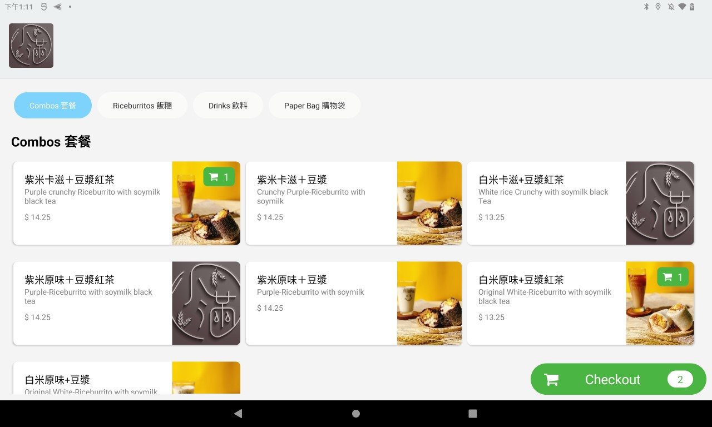

# Grab & Go

## 簡介

Grab & Go 是一個實體點餐機系統，供顧客透過餐廳內的平板點餐機點餐並付款，降低店內的人力成本，提升顧客點餐體驗。系統分為三個客戶端：櫃台端、後台端與 Kiosk，櫃台端。

> 技術關鍵字：React.js、Python、Firebase/GCP、PWA、TWA、Stripe、CI/CD

## 專案負責工作

- 初始技術選用與實作
- 前端應用程式開發，包含櫃台端與後台端
- 後端商業邏輯設計
- 與其他前後端工程師協作開發

## 技術細節

### 前端

- Typescript
- React
- PWA/TWA
- dinero.js

### 後端

- Python3
- Firebase
  - Firestore
  - Functions
  - Hosting
  - Authentication
  - Storage

### 其他

- Git
- GitHub Action (CI/CD)
- Figma
- Stripe

## 金流串接

這份專案是我們團隊透過 Stripe 串接實體信用卡機，讓店家可以透過這套系統來收款，並且透過 Stripe 的 API 來做訂單的管理與明細的開立。

## 專案介紹

### 櫃台端

接收來自 Kiosk 的訂單，並且立即接收訂單並以 USB 熱感應印表機列印出來，讓廚房人員可以開始製作。
也提供簡易訂單管理，可以受理訂單取消、部分／全額退費。

### 後台端

功能列表：
- 特定週期的訂單統計、營收計算、報表匯出（可供報稅）
- 訂單檢視、取消、退費
- 菜單設定、分類設定、價格設定、品項限時／不限時下架、配料設定
- 訂單明細檢視
- 金流出帳設定、系統服務費用繳納設定
- 店家資料設定（地址、稅率、營業時段、稅務設定）
- 小費設定

## 困難點

### USB 熱感應印表機串接

困難點在於這項專案是純前端應用，也沒辦法利用 Web Print API 來達成自動列印，所以我使用以前 Goorder 產品的經驗，透過 Web USB API 來串接熱感應印表機，並且透過列印指令來列印訂單。
但此方法需要開發者自行實作列印圖資，故使用 `html2canvas` 來將 HTML 訂單畫面轉換成圖片，再透過列印指令來列印。

在開發過程中，也遇過店家的裝置在運作數天後會無故斷線，且未於 Web 上提供有效錯誤訊息（Unknown error），當時透過數天的 source code & log trace down，發現問題出在作業系統核心，而非 Web 程式邏輯、瀏覽器，最後在更換新版裝置後才解決問題。

### 訂單金額、稅務計算

在點餐過程中，我們需要將訂單的金額進行即時計算，並且在使用者點餐時即時顯示，這個部分我們使用了 `dinero.js` 來避免浮點數計算的問題。
且美國各州的稅率與規定不同，例如加州會針對品項種類決定是否課稅，我們也需要按照店家設定在後端進行嚴謹的計算，避免有任何金額的錯誤，導致店家違反州法。

### 金流串接

在這個專案中，我們使用了 Stripe 來串接信用卡機，透過 Stripe 的 API 來進行訂單的管理與金流的處理，這個部分我們需要對 Stripe 的 API 有一定的了解，

## Screenshots

### 櫃台端

### 後台端

### Kiosk

